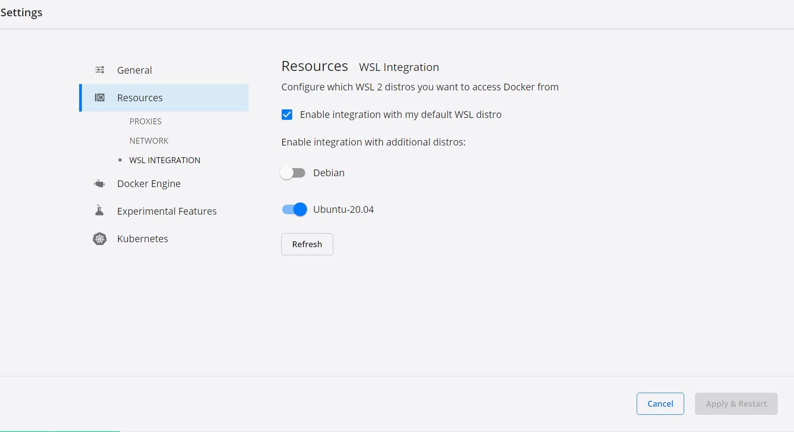
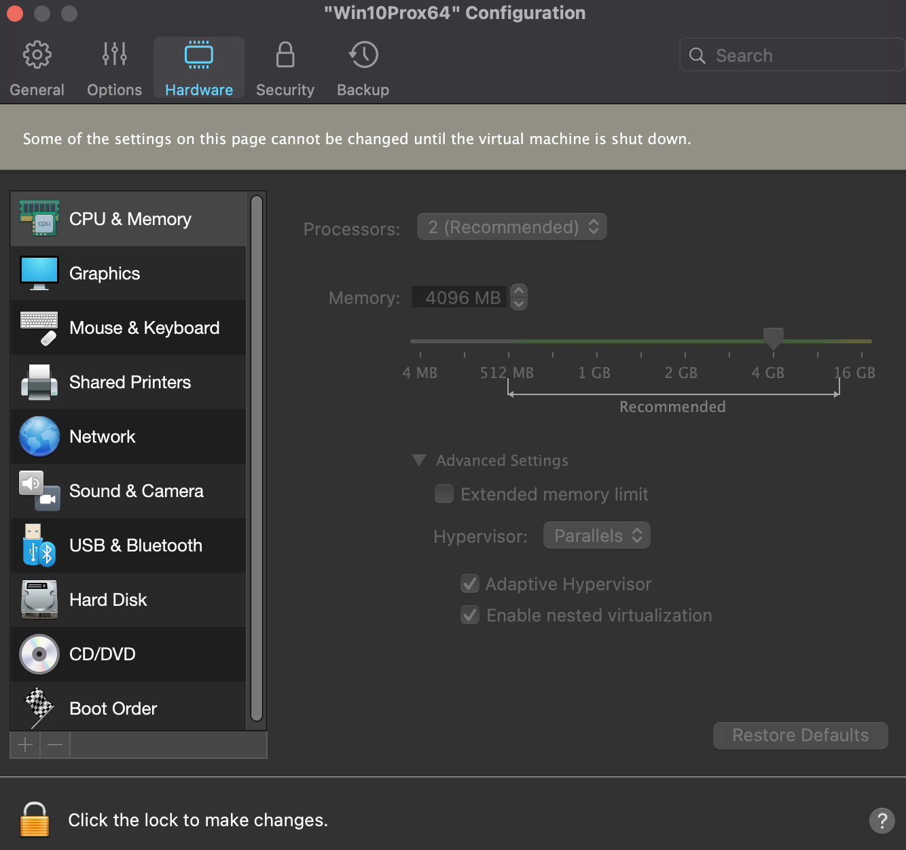

# Debug Things


```
+ kubectl --context kind-kind --namespace kubify apply -f -
Error from server (InternalError): error when creating "STDIN": Internal error occurred: failed calling webhook "webhook.cert-manager.io": Post "https://cert-manager-webhook.cert-manager.svc:443/mutate?timeout=10s": EOF
```
solution coming soon in new version: https://github.com/jetstack/cert-manager/issues/2640
TODO (urgent): https://github.com/jetstack/cert-manager/releases we are going to use the 2 day old version of cert-manager, so upgrade this soon
   Another option: v1.3.1 (stable), actually lemme try that first...


# WINDOWS INSTALL (until we automate these steps):

- install WSL2 (Ubuntu for Windows, the one created by Microsoft): #TODO: automate this flow using ansible
  - # if windows is on a VM, enable vXT (virtualization nesting)
  - # these steps: https://docs.microsoft.com/en-us/windows/wsl/install-win10
    - `dism.exe /online /enable-feature /featurename:Microsoft-Windows-Subsystem-Linux /all /norestart` #on powershell
    - `dism.exe /online /enable-feature /featurename:VirtualMachinePlatform /all /norestart` #on powershell
    - `wsl --set-default-version 2` #on powershell
  - # Install Ubuntu for Windows (by Microsoft, from Microsoft App Store): https://www.microsoft.com/store/apps/9n6svws3rx71
    - # If you have the Microsoft Store blocked (common): https://docs.microsoft.com/en-us/windows/wsl/install-manual
  - # Then install Docker Desktop (with the WSL2 checkmark enabled!!): https://docs.docker.com/docker-for-windows/wsl/
  - `./tools/kubify/cli/scripts/windows-wsl2-enable-systemctl-v2.sh` #on wsl2
  - Docker Desktop Settings -> Enable Kubernetes -> Apply
  - Be sure you covered these steps: https://kubernetes.io/blog/2020/05/21/wsl-docker-kubernetes-on-the-windows-desktop/

IMPORTANT NOTE (choose Ubuntu 20, not Debian, due to Docker-Desktop Debian known networking automation bug):


Now that Ubuntu for Windows is installed (only need to install once), let's use Kubify:
```
# open powershell and run:
wsl -d Ubuntu-20.04
# example env setters
KUBIFY_DEBUG=1
KUBIFY_CONTAINER_REGISTRY=ecr
# example commands to start
cd ~/git/kubify
# in case we are on WSL2 or container and so therefore are not using NetworkManager
sudo sh -c "echo 'nameserver 127.0.0.1' >> /etc/resolv. conf"
export PATH=$PATH:$(pwd)/tools/kubify/cli
sudo apt -y install ntpdate
sudo ntpdate -sb time.windows.com
kubify up
```

____________________________________________________________________________________________

# Ansible on Mac stuck at "Add local.kubify.local resolver port"
remove your dnsmasq kubify file and then `kubify up`
why: some Ansible issue, will fix it with a check

# Ansible script fails on brew install during Kubify Up

Manually install the offending packages (this seems to work):

```bash
brew install minikube yq jq jsonnet kubetail kubernetes-cli kubecfg kubectx helmfile coreutils awscli dnsmasq watch np
```

# Secrets Creation Blank File issue
Delete your secrets file (example: rm -f ./secrets/secrets.dev.enc.yaml) and then:
EDITOR="code -w" kubify secrets create dev
or
EDITOR="subl -w" kubify secrets create dev
or
kubify secrets create dev

# Issue 000003 (): bash linebreaks error

If a bash file (or other files really) was ever saved on Windows, generally in the world of coding that means you might need to dos2unix that bash file
Recursive before commit: `find . -type f -print0 | xargs -0 dos2unix`


# Important Note (until we fix this edge case that might come back up)

This software is alpha mode and you must do this as a hard reset for local environment
Docker-Desktop -> Prefrences -> Resources Disk Image Size, make volume smaller and apply
This is important if you get stuck installing kubeDB (from a previously failed version)

# If you run into apt-get issues
`sudo rm -f /etc/apt/sources.list.d/download_docker_com_linux_ubuntu.list /etc/apt/sources.list.d/apt_kubernetes_io.list`

# If you run into DNS issues during kubify up (on Linux)
`sudo service systemd-resolved start`
then debug the install_linux.yaml file

# If you run into port conflict and want to find out why
```
sudo apt-get install -y bind9
sudo netstat -tulpn | grep ":53 "
```

# Issue 000001 (): If namespace deletion is stuck locally in docker desktop's kubernetes:
STATUS: 
This can be RESOLVED with manual click (see image below), but the TECH DEBT automation of this fix is TODO (I/We should automate this fix)
    - TODO (in order to automate the fix): need to find out the cli or api for hard resetting the local docker desktop kubernetes cluster and then add it to ansible and cli
        - HOW: to force stop all containers
        - WHY: root cause is coredns k8s containers (and similar) waiting forever for connections to drop
Example error: 
`Error from server (Forbidden): error when creating "STDIN": secrets "dockerhub" is forbidden: unable to create new content in namespace kubify`
Investigation:
- Find out what resources are left in the stuck namespace with: `kubectl api-resources --verbs=list --namespaced -o name | xargs -n 1 kubectl get --show-kind --ignore-not-found -n kubify`
    - Example Output: `error: unable to retrieve the complete list of server APIs: mutators.kubedb.com/v1alpha1: the server is currently unable to handle the request, validators.kubedb.com/v1alpha1: the server is currently unable to handle the request`
        - This was from an old typo in the api version, so I will create a PR to the public https://github.com/kubedb/operator repo to fix this and will try to get a workaorund in place in the meantime #TODO (Willy will take this task)
    - Helpful references of endpoints and versions: 
        - https://kubernetes.io/docs/reference/generated/kubernetes-api/v1.19/
        - https://kubedb.com/docs/v2021.03.17/guides/postgres/initialization/script_source/
    - RESOLUTION: I hard reset my local Docker Desktop's K8s to fix this:

It is also useful to install the WSL2 plugin for VSCode #TODO: automate this too
And make sure to to this: https://docs.docker.com/docker-for-windows/wsl/ and then restart your session #TODO: automate this

# Issue 000002 (): If WSL2 Is Not Enabled (While Trying to Install Ubuntu for Windows on Microsoft Store):
Install pre-reqs: #TODO: automate these 2 installs (since they are already automated on Mac)
  * https://hub.docker.com/editions/community/docker-ce-desktop-windows/
  * https://code.visualstudio.com/Download
If WSL2 (Windows Feature) is not enabled: Control Panel -> Programs -> Turn Windows Features on -> Checkmark "Linux Sub-System for Windows", Click Ok, Click Restart (when prompted) -> Open Microsoft Store (or manually/silently using https://docs.microsoft.com/en-us/windows/wsl/install-manual) again and try install of Ubuntu for Windows again:

that will use wsl1, we myst them upgrade it to wsl2 (TODO: automate all this for windows users)
you might need to enable nested hypervisor, if you are running Windows in a VM:

```
PS C:\Users\w> wsl --list --verbose
  NAME      STATE           VERSION
* Debian    Running         1
PS C:\Users\w> wsl.exe --set-version Debian 2
Conversion in progress, this may take a few minutes...
For information on key differences with WSL 2 please visit https://aka.ms/wsl2
WSL 2 requires an update to its kernel component. For information please visit https://aka.ms/wsl2kernel
PS C:\Users\w>
```
so to fix this: to upgrade wsl1 to wsl2 (for windows users)
follow this https://docs.microsoft.com/en-us/windows/wsl/install-win10#step-4---download-the-linux-kernel-update-package
  microsoft will have you install: https://wslstorestorage.blob.core.windows.net/wslblob/wsl_update_x64.msi
for more info: https://docs.docker.com/docker-for-windows/wsl/#download

#kubedb local reset
    docker docker settings -> resources -> make the disk size limit smaller -> apply (hard reset your k8s local stack for the win)
    and then reset helm
    ```
    rm -rf ~/.helm/cache/archive/*
    rm -rf ~/.helm/repository/cache/*
    # Refreash repository configurations
    helm repo remove appscode stakater jetstack architectminds
    helm repo update
    helm repo add appscode https://charts.appscode.com/stable/
    helm repo update
    helm install kubedb appscode/kubedb --version v2021.03.17 --namespace kube-system
    ```
#kubify up producing brew dnsmasq error
    # will fix this forsure, but for now if you run into it
    ```
    Error: The `brew link` step did not complete successfully
    Error: Directory not empty @ dir_s_rmdir - /usr/local/Cellar/dnsmasq/2.84
    ```
    # workaround is
    `brew unlink dnsmasq && brew link dnsmasq`

#kubectl apply gives schema missing command:
see https://kubernetes.io/docs/tasks/extend-kubernetes/custom-resources/custom-resource-definitions/
since kubernetes had some major breaking changes lately, we must adapt to apiv3 apiextensions yaml expected format, so we added:
```
      schema:
        openAPIV3Schema:
          type: object
          properties:
            spec:
              type: object
              properties:
                cronSpec:
                  type: string
                image:
                  type: string
                replicas:
                  type: integer
```

#general useful troubleshooting things
```
#explain resource for debugging
kubectl explain []

#run specific function
kubify _generate_manifests

#interactive bash terminal into any pod https://kubernetes.io/docs/tasks/debug-application-cluster/get-shell-running-container/
kubectl -n kubify exec --stdin --tty entrypoint-c45cz98z9-1jlwa -- /bin/bash
```
# old version of ansilbe causing brew issues
```
Error: An exception occurred within a child process:
  NoMethodError: undefined method `chomp' for nil:NilClass
```
if so, it's probably ansible 1 or 2, instead of 3.X+ (where they recent fixed brew things)
```
ansible --version
ansible 2.10.7
brew upgrade ansible
brew unlink ansible && brew link ansible
```
still?
```
brew uninstall ansible
brew install ansible
```

# troubleshoot entrypoint container mount point things
```
kubectl get pods -n kubify
kubectl -n kubify exec entrypoint-54d6c57bbd-np75d sh -- ls -al /data/home/.aws
kubectl --context kind-kind --namespace kubify exec -it entrypoint-54d6c57bbd-np75d -- bash -l -i -c kubify
```

# to shell into the running container
```
kubectl get pods -n kubify
kubectl -n kubify exec --stdin --tty example-node-svc-64856984b-7d72b -- /bin/bash
```
