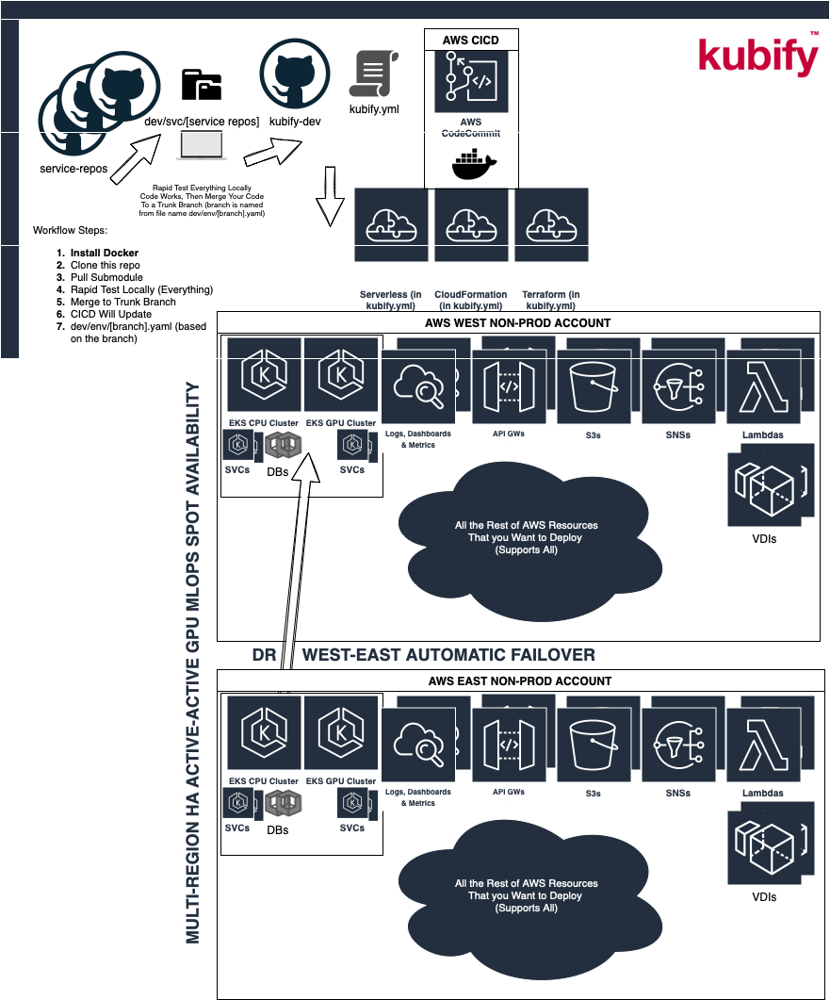

Welcome!
========

Kubify OS, Version: 9010.5.0

Well hello there! Welcome to Kubify OS Python Package Repo

The Turn-Key DevOps/MLOps OS Developer-First Stack

Who is this for?
================

Data Scientists/Devs/DevOps/MLOps Person/Teams/Companies who want self service and autopilot

To rapid develop many services/models fast simultaneously on full env

1. Automated Self-Service Clouds and Services.
2. Automated DR. Automatic Multi-Cloud Failover.
3. Rapid Test/Develop many Services/Models Simultaneously.
4. Full Automated Integration Test. Stable Prod.

Turn Key DevOps/MLOps DR-Enabled Scalable Lowest-Cost Full Rapid Testing Stack

Ideoligy: If it works on your laptop/test/notebook, it works in prod

How?
====

DevEx First Class Ideology

.. figure:: ./docs/img/README_md_imgs/the-future.gif
   :alt: FUTUREOFDEVOPS9000

Contributing:
~~~~~~~~~~~~~

A. devcontainer or container
B. ``tox``
C. ``make docker``
D. ``make pip``
E. ``make pythons``
F. ``make test``
G. and more ..

.. |Docker| image:: https://github.com/willyguggenheim/kubify/actions/workflows/docker-image.yml/badge.svg?branch=main
   :target: https://github.com/willyguggenheim/kubify/actions/workflows/docker-image.yml
.. |PyPi| image:: https://img.shields.io/pypi/v/kubify.svg
   :target: https://pypi.python.org/pypi/kubify
.. |PyUp| image:: https://pyup.io/repos/github/willyguggenheim/kubify/shield.svg
   :target: https://pyup.io/repos/github/willyguggenheim/kubify/
.. |Docs| image:: https://readthedocs.org/projects/kubify/badge/?version=latest
   :target: hhttps://kubify.readthedocs.io/en/latest/?version=latest

AWS Loves Kubify.

On-Boarding
~~~~~~~~~~~

1. ``make clouds``
2. ``kubfiy start-all``

Docs
~~~~

1. https://kubify-os.readthedocs.io
2. CONTRIBUTING.rst or/and USAGE.rst

Summary
~~~~~~~

Docker-Compose is a tool for DEVS testing. 

Terraform is a tool for DEVOPS/MLOPS deploying.

Kubify combines the 2 worlds AND lowers your bill.