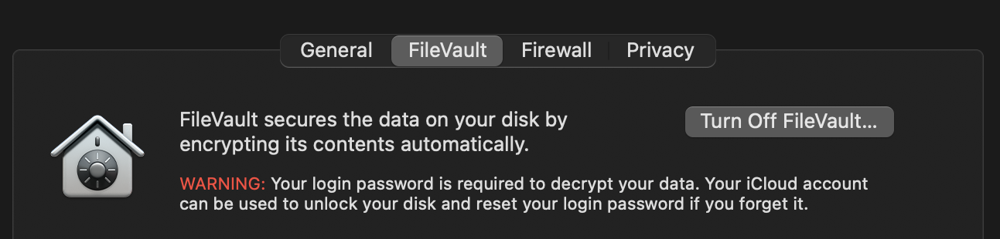
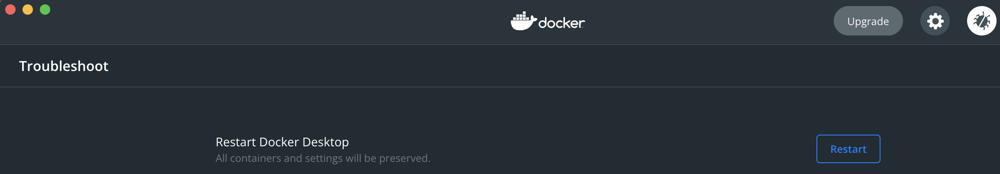

💻

# Description

Kubify is a CLI tool to manage the development and deployment lifecycle of microservices.

Kubify is a DevEx (Developer-First) Kubernetes Turn Key full SDLC Framework (DevOps Solution) that allows you to easily rapid test entire infra locally (the same way as it's deployed), driving amazing quality in services' code commits. 

Make Kubernetes easy to use by adopting the 1 Yaml per Service, 1 Yaml per Env, 1 Folder for FE and 1 Folder for BE full DevEx clear automation strategy of Kubify and make our hardworking Devs/DevOps/DevSecOps engineers happy.

Think dev team efficiency and happiness. Think on-boarding reduced from weeks to only 5 minutes. That should say a lot.

This is FREE turn key DevOps revolutionary software. If you use Kubify, please make sure to donate: [](https://www.paypal.com/donate?business=MSRFJHSGCKGCG&item_name=Kubify&currency_code=USD)

# By Why ?


So you might be using Docker-Compose for local testing, but that's not the entire Terraform infrastructure that is deployed, so as developer you end up spending a fraction of your day (every day) on building test workflows on your machine, but they never match the real full infrastructure, so you accidentaly merge a bug and then find out in the cloud it breaks. Well what if Terraform instead WAS Docker-Compose. What is Terraform+DockerCompose+LocalStack meant that you can turn off your WiFi, go off the grid and STILL know that your commit will not break the cloud when it's pushed?! 


What if you can test the entire cloud on your laptop?! Yes, the entire cloud, EXACTLY how it's deployed into AWS!!


# By Why ?


What if you can test the entire cloud on your laptop?! Yes, the entire cloud, EXACTLY how it's deployed into AWS!!

Alright, so what if LocalStackAWS, Docker-Compose, Serverless-Framework, Terraform, CloudFormation, Kubernetes, EKS, Skaffold and Skater Hot Reloader had a baby? This is what it would look like. 1 Tool To Rule Them All, 1 Command To Test Anything In Your Org !!

So you can code at lightning speed. So your commits are already tested in full on your machine. So you can feel confident about your code before you push it within the first 5 minutes of working at a company !!

It's impossible right? Terraform and Docker-Compose will always be seperate tools?! NOPE. Clone This Repo if you want to live in the future !!


# By Why ?

Because Docker-Compose and Terraform are 2 different tools (Kubify is the combination of the two). Because Self Service Auto-DevOps needs a home (Kubify's strategy is most scalable for DevOps Support Model, Driving Self Service as First Class effort).

What if you can rapid test changes to your Cloud Resources (Your ENTIRE Cloud), Services, Databases and Lambdas all at the same time, right on your Laptop? What if that was free? What if that was easy to migrate to?

# Setup Your Workstation (in more detail)

Option A: Using a Container (Everything Installs/Runs in Container, NEW Approach): `./kubify up_container` (or "docker-compose up")
```
# Example Workflow:
./kubify up_container # this is install (only need to run once)
docker-compose run "cd dev/svc/example-django-simple-svc && kubify start"
# make service code changes, rapid tester reloads automatically..
# That's it! Happy Coding!
# If you want to shutdown:
docker-compose stop # if you want to stop the engine container
kind stop # if you want to stop the cluster
```
    

Option B: Using your OS (Direct Install Deps, Rest Runs in Containers): `./kubify up` (or "kubify install")
```
# Example Workflow:
./kubify up # this is install (only need to run once)
cd dev/svc/example-django-simple-svc # service that you want to rapid test 
../../../kubify secrets edit dev # if you want to edit secrets (then you would push)
../../../kubify start # starts service and listens for code changes (all dependant Services/Databases/awsResources run first)
# make service code changes, rapid tester reloads automatically..
# That's it! Happy Coding!
# If you want to shutdown:
kind stop # if you want to stop the cluster
```


# Setup


```

## New Account Config ##

# Create 3 AWS KMS Keys:

 # 1) kubify_secrets_dev

 # 2) kubify_secrets_stage

 # 3) kubify_secrets_prod

 

```


```

## Configure Env ##

export KUBIFY_DEBUG=1

export KUBIFY_CONTAINER_REGISTRY=ecr

export UNIQUE_COMPANY_ACRONYM=os

export EDITOR="subl -w "


## Local Testing ##

./kubify up

#start entire infra locally !!

kubify start-all

#cd into a specific service

cd dev/svc/example-node-svc

# start listening for code changes !!

../../../kubify start

```

fill out `data` with `key: value` pairs, example:

```

data:

	EPIC_ENV_VARIABLE_9000: AWESOME_VERSIONED_SECRET_9000

metadata:

  name: example-django-simple-svc

type: Opaque

```

your gonna want to save and close that vim window (wq!) ..

in your browser or postman GET/POST to your running service https://example-node-svc.local.kubify.local

or to any of your other running services https://[service folder name].local.kubify.local

```

../../kubify secrets edit dev

```

kubify now listens for any code changes on your service, as well as has THE REST OF THE INFRA RUNNING ON YOUR MACHINE!!

.....and it automatically (immediatly) tails the logs of all services in the cluster .. VERY NICE!!!

When you fork this into your private repo: I recommend removing these lines from .gitignore file:

```

dev/svc/*/secrets

dev/svc/*/secrets/*

dev/pub/*/secrets

dev/pub/*/secrets/*

```

If you have forked this repo into your org: You should remove those 4 lines at the top of the .gitignore file (to enable encrypted git versioning of secrets, as designed).

Make sure you have disk encryption on!!!!!!!!!!!! 

NOTE: `kubify []` (when you run any kubify command) will actually try to set this anyway, but double check .. 



!!THIS IS SUPER IMPORTANT!!

Make sure you are blocking all incoming connections to your workstation!!!!!!!! 

NOTE: `kubify []` (when you run any kubify command) will actually try to set this anyway, but double check .. 


# Hard Reset

1) Reset your workdir `rm -f ./._kubify_work`

2) Reset your Docker Desktop (in settings or delete `/var/docker/*` if on linux and restart docker)



# If you want to Reset

Just delete the kind-kind container (the entire kubify shows up as 1 container total on your workstation host docker), that or use the kind command to delete the cluster (the container with the cluster on it)

The local testing idioligy is that: You should be able to reset at any point. This is why it's SO DEEPLY IMPORTANT to have 100% coverage on your migrations/seed (so every new environment works every time it's created with no manual steps after) !!

# Important Notes

Dockerfile.dev = used for local development, used when ../../../kubify start (or start_all)

Dockerfile.release = used or cloud, also used for depends_on, also used when ../../kubify run (or run_all)

../../../kubify start (or start_all) tells Skaffold (along with Skater Hot Reloader) to start the service and listen for

code changes (see “sync” section of kubify.yml) for rapid code software developement listening folders

../../kubify run (or run_all) tells Skaffold to deploy the service (to the local cluster)

you are testing the real infrastructure locally, so any changes that worked locally should be pushed

any changes to the secrets folder are automatically encrypted, they should be pushed to repo

when updating code for a git submodule service (in dev/svc/[service_name]), youmust push the service code to itʼs git submodules repos first and then once all the submodules are git pushed, then push the parent (kubify-dev, or the new fork's named) repo

list pods: kubectl -n demo get pods

exec into a pod: kubectl -n demo exec -it {POD ID} -- /bin/bash

get the running service ips: kubectl get service --all-namespaces

get the info of services and dbs: kubify ps

	NOTE: DBs password is dynamic (not static) and is accessibly as an evironment variable (NO MORE STATIC PASSWORDS, YAY) and can be referenced (like ${PG_PASSWORD}) see kubify.yml in example service repos for examples

connect your database ide to a kubedb db: kubectl -n demo port-forward [ kubedb pod name ] [ port:port ]

to deploy a manifest to your cluster (it's a kubernetes cluster, you can do anything with it that is safe): kubectl --context kind-kind --namespace demo apply -f [ file name ]

if you want a bunch of info: `kubectl explain []`

# To Reset A Secrets File

Delete your secrets file (example: rm -f ./secrets/secrets.dev.enc.yaml) and then:

EDITOR="code -w" kubify secrets create dev

or

EDITOR="subl -w" kubify secrets create dev

or

kubify secrets create dev

SIDE NOTE: if the secrets folder or file is missing, it will be created when you run `kubify start` or `kubify secrets create [env]`


# Windows 

Before commit to repo: `find . -type f -print0 | xargs -0 dos2unix`

# Awesome

Compatible with Linux, Mac and even Windows!!


# But Why Kubify


Because Turn Key DevOps needs to exist.

Because devs should be allowed to focus on coding.

Because Cloud needs to be portable and Open Source.

Because devs should be able to enable free OS logging, apm, localstack, .. easily.

Because devs should be able to run the entire infrastrucutre on their laptop, to test on a full real environment rapidly.

Because coders are rockstars. We should respect all hard working coders by automating things as much as possible. Coders need auto-pilot. 

This software allows developers to test entire infra locally (in full) and deploy to the cloud (easily), driving quality and efficiencies #RAPIDTESTING #DEVEX #DEVOPS #DEVSECOPS #FREESOFTWARE

This tool allows you to (with only 2 terminal commands: `kubify up` && `kubify start-all`) have the ENTIRE infra running on your laptop (yes, the ENTIRE infra, amazing, revolutionary), then you simply cd into the microservice (cd into a dev/svc/[] or dev/pub/[] folder) folder you want to work on (then run kubify start) to start rapid testing (listens for code changes, also runs your unit tests on each save and auto-configures vscode for breakpoint configuration)!!!!!!

Imagine this new world: A developer in the first few minutes (even on day 1) can easily ^^ (and then can focus on their actual code)!!!!!!!!!!!!!!!!!!!!!!!!!!!!!!!!!!!!!!!!!!!!!!!!!!

Run the exact real environment locally that you are running in the deployed k8s env (so you can be super sure that your commit won't break anything)!!!!

This is really important in the DevOps industry (so please contribute)!!!!

Our hard working devs should get a proper full turn key solution on day 1 that is battle tested heavily. 

Think cloud, but open source. DevOps needs to evolve into DevOps 4.0, 4.5 and 5.0 fast..


✅✅✅✅✅✅✅✅

For SREs (where every second of uptime counts): Mult-Cloud is also important. Really important. Think site/api/microservice/mlops multi-cloud redundancy turn key!!

For Devs/DevOps/DevSecOps/DevEx: Local testing (with the ENTIRE infra running locally perfectly) should be a click of a button (THIS FEATURE IS LIVE)!!

✅✅✅✅✅✅✅✅


# Questions Answered


If you want to learn the commands that the kubify wrapper is running: `KUBIFY_DEBUG=1 kubify {args}`


Example: 

```

KUBIFY_DEBUG=1 KUBIFY_CONTAINER_REGISTRY=ecr UNIQUE_COMPANY_ACRONYM=os kubify up

```

NOTE: UNIQUE_COMPANY_ACRONYM should be unique


# Secrets Editing Examples


To use default editor:

```

cd dev/svc/be-svc

kubify secrets create dev

```

To use alternative editor:

```

brew install cask sublime-text

export EDITOR="subl -w"

cd dev/svc/be-svc

kubify secrets create dev

```

# How to contribute to the OS repo


https://github.com/willyguggenheim/kubify is the official OS repo (combination of the 2015 and 2017 versions of Willy's OS kubify_com repo and refactored in 2021 to the offical OS repo, so this is the main official repo to contribute to)

If you find any bugs, have built and added any cool new features please open a PR.

If you are new to open source, this link helps get you started with your first PR to an OS repo.

For more information on the contribution PR review flow: https://github.com/firstcontributions/first-contributions


# Tell me again why


Because DevOps loves super hard working Developers and genius Data Scientists (so let's make it easy for them).


Calibration of this tool: If a developer on day 1 can do all of these things without DevOps support, then we have suceeded:

1) run the entire infrastructure on workstation matching exactly how it's ran in production with 1 command

2) make a 1 line change to a service by starting debug a full debug ide with 1 command, test it with 1 command, unit test it with 1 command and then deploy it by changing 1 environment file (THIS FEATURE IS LIVE!!)

3) docs being self-sufficient with no manual intervention (fix all edge cases), make it just perfect (this is why your coding contributions to this very repo are SUPER important, you amazing 🤘hardcore rapid testing🤘 genius hard working coder!!!!!!)


I think we all know what kind of justice that would serve for our hard working devs..

This way a developer on day 1 can be effective, up and running, as well as all devs can rapid test the entire infra locally and be super confident in the quality of their deployments (runs the same way locally as in the deployed env)


Service delivery frameworks are programming langauges. This is a 'best practices' perscription (automated turn-key framework) for smooth SDLC, to cover most of the pain points in DevEx, produce high quality code, enable rapid testing, enable rapid self service for devs and make all your hard working developers super happy!

Kubernetes can be complex (see below examples), so let's automate+organize and in turn simplify it. Let's Kubify it!

https://k8s.af/

https://news.ycombinator.com/item?id=26106080

https://www.trendmicro.com/en_us/research/21/b/threat-actors-now-target-docker-via-container-escape-features.html

https://news.ycombinator.com/item?id=26121877


# Important Notes


The "dev" environment is the same environment when running locally as the deployed environment (both local and the actual dev deployed k8s env use the "environments/dev.yaml" file, by careful design)


# Key Concepts

1 yaml per service

yup, you heard that right, it's finally here, 1 yaml file total, with minimal syntax (that still allows advanced usage patterns) that developers and devops can easily maintain, 10x easier!!!!!!!!!!!!!!!!

1 yaml per environment

dev.yaml = "local" and actual deployed "dev" environment, as they are share a file, by careful DevEx design .. yes, you heard me right, run all of dev on your laptop also and rapid test on it locally in 2 a total of 1 commands from scratch, even on day 1, 10x easier!!!!!

dev.yaml = for local and dev env (both)

1 folder for backend services

1 folder for frontend services

Ingress controller encrypts traffic between services

Ingress controller automation encrypts traffic between host and services

Ingress controller generates a certificate on the fly and added to your trusted certificates on host

Services autmatically listen for code changes when running `kubify start`

Kubify will AUTOMATICALLY generate a Dockerfiles for you, by auto-sensing the language you have written the service in (if there is no Dockerfile.dev or/and Dockerfile.build)!!!!!

options for Dockerfile placement:

	A) {{ app_dir }}/Dockerfile.dev and {{ app_dir }}/Dockerfile.build (need both to use a custom dockerfile)..

	B) no Dockerfile* in the app_dir (because it will automatically create one for you based on the langauge)!!

..so you don't get those DevSecOps access patterns mixed up ever in a yaml

Pure DevEx Developer love ..

The point of this tool is to make Kubernetes easy for Developers. 

A developer (or devops) only has to fill out a yaml file to bring in any service.

Databases are automated with KubeDB and controlled from the same yaml file.

Crons are defined in the same yaml.

Seeding/Migration configuration is also defined in the same yaml.

Defaults are in place, in case a developer wants to provide a minimal yaml.


Secrets are securely versioned in the same mono repo. Each time a developer runs `kubify secrets edit dev`, AWS IAM first checks wether the user still has access.

The Environments folder has 1 yaml file per environment. controlling what is deployed where. 

 A developer can control what version tag of the service, what secrets bundle git tag or commit sha to use and what config git tag or commit sha to use where. Rolling back secrets, service version and config version are as easy as a 3 line PR in GitHub.


Automatic tagging, artifact bundling, container building, deployments and release flows are in place using GitHub Actions CICD and are developed inside the same mono repo.

Route53 is controlled using Kubernetes integration, for cloud Blue-Green tested deployments.


Terraform changes are made in an infrastructure folder and are visible/controlled with 2 approvers using Atlantis and GitHub integration. All AWS resources are automated for deploying the same stack (as your laptop) to the cloud (EKS,…).


When a developer wants to run all services on their laptop, all they need to run is `kubify run-all`. Kubernetes using Docker Desktop (Mac/Linux/Windows) will install/re-instal/configure/re-configure itself, pull the latest pushed containers and start the stack, without using a lot of resources (developer machine remains fast). When a developer wants to edit a specific service’s code, they are developing on an environment deployed automatically to their laptop (Kube DBs, Queues, Crons, Services,.. and all). Live code reload is used to develop and test at a rapid pace.


All in all, the tool is revolutionary and is a solid prescription for full Kubernetes automation, that would fit in most situations, make developers super efficient and reduce the burden on devops for release engineering.


The final result is a developer on day 1 can bring up the entire stack on their laptop, deploy to environments visibly (in a simple PR) and on-boarding becomes a breeze!


Let's make kubernetes the most important devops tool on the planet (because it's portability and interfaces are ❤️ pure love ❤️)!

Let's make our hard working devs super happy together (because all devops things will be automated as much as possible)!

Let's automate as much as possible together (the more contributors, the better devops 4.0 will be)!

Let's make DevOps 4.0 portable, flexible, automated and open source!!!

Let's build DevOps 4.0 together!!!


Version 1 of Kubify is live in and in master branch. 

Let me know if it works nicely on your Apple and Linux things.


This is what it feels like to run `kubify up`:


Want a rush? Run `kubify up`! Hey, that rhymes!


So let's build awesome stuff together!!!


Special thank you to the fully automated open source interfaces (local and deployed indentical automation), such as KubeDB and Kafka!!!

https://github.com/operator-framework/awesome-operators


In the Kubernetes world, this is truly revolutionary, one of a kind (due to local testing automations matching deployed environment automations turn key and hybrid k8s portable interfaces) and was *super* fun to build!!!


This is the age of the open source auto-devops devex-first devsecops-first fully automated portable cloud!!

Alright, who is ready for the inevitable future of DevOps and Software Development??

`print laymans terms`: This is Auto-Pilot for DevOps. Make your DevOps, DevEx, DevSecOps and especially your Developers Happy, by allowing them to be super productive, using turn kuy, fully automated solutions that allow them to test the software locally (on their very same workstation they currently use or on a side car workstation, if they for example need GPU workloads) the same exact way as they are ran in your deployed infra (cloud, on prem or a side car workstation tester nuc). Allow your developers to have a fully automated turn key DevOps solution, allowing your devops to focus on security, customers and especially to kubify. 

Save huge on cloud costs. Run it all on your workstation. Run multiple environments on your workstation (think async local cicd edge computing future we will live in)..

The feeling your devs and devops get when the entire infra is portable and running on their workstation (for rapid testing on a full real environment):


`print laymans terms | summary`: This makes your DevOps, Security Teams and especially your devs multiple times as happy.


Still need motivation?: The Lead Developer and Creator, Willy Guggenheim, works next to 9 calm tiny chihuahuas, loves MetalCore, Latino Pop, Ambient, Classical, EDM & especially Hip Hop !!

Still need motivation (THAT IS EASY TO FIX): https://www.youtube.com/watch?v=7m0n8h8b89M !!

Kubify = The Open Source, Free, Portable, Fully Automated, DR-Enabled, Turn Key Head First Clou that let's you run your entire infra locally the same way as it deploys in the cloud !!


# What Are All These Folders About?

- dev/aws/ = eks 4-cluster ha+failover cpu+gpu deployers (deploys the 4 clusters: cpu+gpu in west & cpu+gpu in east for dr and ha)
- dev/env/ = what versions of services are deployed to what aws environment (including eks clusters, sls, cf and terraform kubify)
- dev/svc/[*] = private services (folders and/or git submodule folders for backend eks services)
- dev/pub/[*] = public services (folders and/or git submodule folders for frontend eks services)
- src/ = the magic

# Concept

- dev/svc/[*]/kubify.yml file = Docker-Compose, Serverless-Framework, Terraform, CloudFormation, all in 1 File and easy to Read (Accepts ShortHand Kubify SelfService Syntax and Even Real Full TF/CF/SLS/Manifest Syntax as Well) !!
- `kubify start` = Ansible reads kubify.yml depends_on Service Chain (all Dependant Services Start in Order), Then It Automatically Creates CloudFormation Templates, Automatically Creates Terraform, ... and it Automatically Deploys Everything On Your Laptop (The SAME Way it Deploys To The Cloud, All AWS Resources On Your Laptop, Entire Cloud), Then All Of Those Services Listen For Code Changes (So You Can Edit Them All Locally At The Same Time) !!


# Magic, Pure Magic!
 

For more information on these topics, please review all the *.md files (more.md, docs.md and todo.md) ....

This engine deploys your AWS resources for you (self service idioligy), both to the cloud AND to your workstation (you simulate the entire cloud on your laptop and rapid test on it) ....

Streamlined Self Service for Developers (Auto DevOps)
 
1 Yaml File Per Service (Easy to Migrate/Maintain)
 
1 Yaml File Per Environment (Easy to Roll Back/Debug/Patch)
 
Dependant Services Automatically Start Listen for Code Changes (Automatically)


# Setup Your AWS Cloud
 
 
1) Create Your KMS Keys (Example: 1 Per Env) and Add Users to Each.
 
2) Run `dev/aws/deploy-west-east-eks-dev.sh` (Deploys and/or Updates Configs on your dev EKS Clusters).


# Summary, Install/Reset Workstation


1) Install Kubify:

    Two Options:

    A) Full Install (admin rights required during install): `./kubify up`

    B) Install Inside Container (no admin rights required): `./kubify up_container`

2) Uninstall Kubify:

    Two Steps:

    A) Delete The Kind-Kind Container: `kind delete cluster`

    B) Delete RapidT Kubify Container: `docker-compose stop && docker-compose rm` 

# Cleanup Cloud (For Testing Beta)

```
eksctl delete cluster --name "kubify-cpu-dev-west" --region us-west-2 &
eksctl delete cluster --name "kubify-gpu-dev-west" --region us-west-2 &
eksctl delete cluster --name "kubify-cpu-dev-east" --region us-east-1 &
eksctl delete cluster --name "kubify-gpu-dev-east" --region us-east-1 &
wait
```


# Sweet, Now What
 

1) Rapid Test Your Services Until They Work (Make Code Changes to Multiple Services and Watch them Hot Reload, Unit Test, ..) !!
 
2) Contribute to this repository (it will remain open source for the long run) ..
 
This is FREE (and Open Source) turn key DevOps revolutionary software that I worked VERY hard on. If you use Kubify, make sure to donate (if you use this in prod, then MAKE SURE AND DONATE PLEASE): [](https://www.paypal.com/donate?business=MSRFJHSGCKGCG&item_name=Kubify&currency_code=USD)

You need music. Follow DJ EPIC CODER (Willy Guggenheim) on Spotify: https://open.spotify.com/user/1245085779?si=7b16f3916e08407

Made by devs, for devs

#AUTOPILOTFORDEVOPS

#STAYINSPIRATIONAL

#FREESOFTWARE

#THEFUTURE

#DEVLOVE

#DEVEX

💻